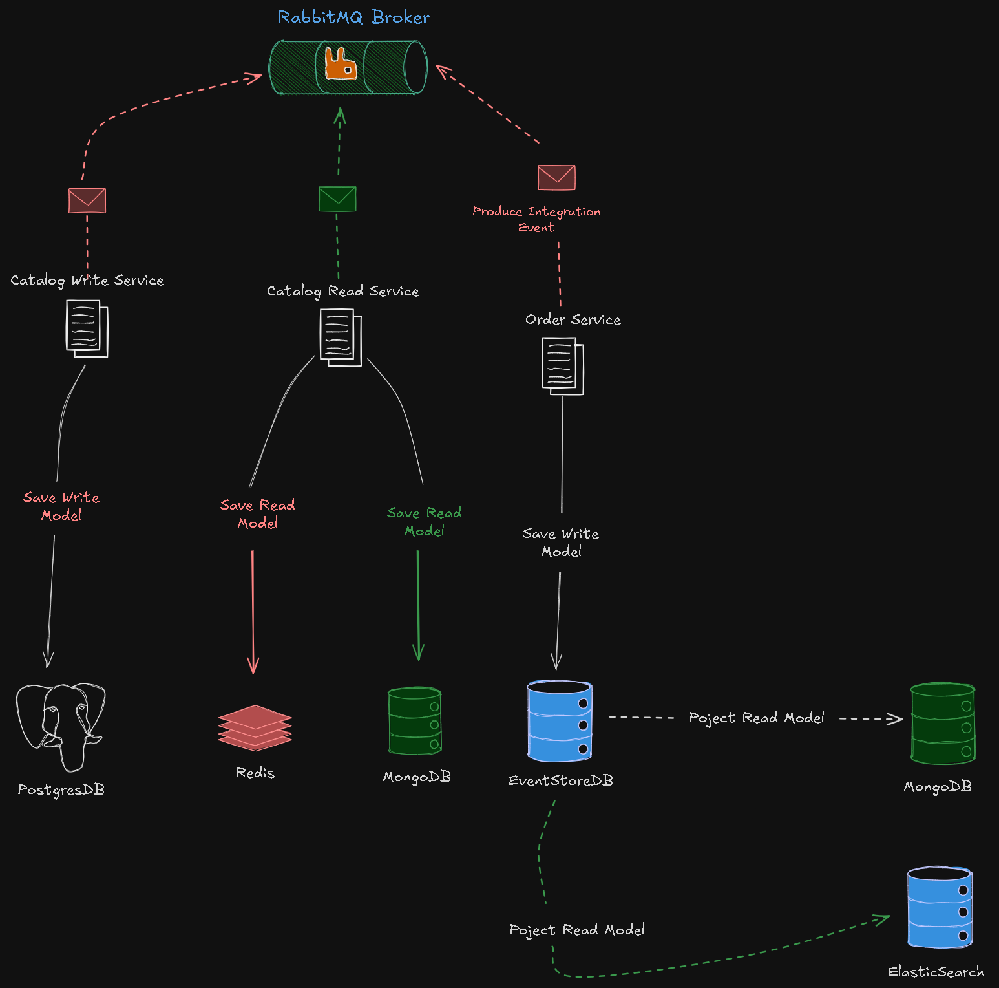
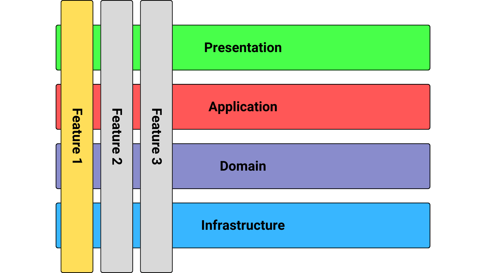

# 🍕 Go Food Delivery Microservices

[](https://codespaces.new/DavidReque/go-food-delivery)

> `Go Food Delivery Microservices` is an educational project that implements a food delivery system using microservices in Go. The main objective is to **learn and demonstrate** how to build distributed applications using different architectural patterns and modern technologies.

**This project serves as a practical reference for developers who want to learn microservices, Event Sourcing, CQRS and other advanced architectures in Go**

💡 **Educational Purpose**: This project is designed as a learning tool to understand advanced software architecture concepts. Each service implements different patterns to demonstrate best practices.

## 🎯 **Why this project?**

- **Learn Microservices**: Practical implementation of distributed services
- **Architectural Patterns**: CQRS, Event Sourcing, Domain-Driven Design
- **Modern Technologies**: Go, Docker, OpenTelemetry, EventStoreDB
- **Real Use Cases**: Food delivery system as a practical example
- **Clean Code**: Implementation following SOLID principles and Clean Architecture

## 🚀 **Implemented Features**

### **🏗️ Architecture and Patterns**

- ✅ **Vertical Slice Architecture** as a high-level architecture, grouping functionalities by features instead of technical layers
- ✅ **Event-Driven Architecture** over RabbitMQ Message Broker with a custom Event Bus for asynchronous communication between services
- ✅ **Data-Centric Architecture** based on CRUD in the Catalogs Read Service, optimized for read operations
- ✅ **Event Sourcing** in audit-based services like Orders Service, maintaining complete change history

### **⚙️ Design Patterns**

- ✅ **CQRS and Mediator Pattern** implemented over the Go-MediatR library, separating commands from queries for better scalability
- ✅ **Dependency Injection and Inversion of Control** using the uber-go/fx library for automatic dependency management

### **🌐 APIs and Communication**

- ✅ **RESTful API** with the Echo framework and automatic documentation using swaggo/swag for Swagger
- ✅ **gRPC Communication** for internal communication between services with high performance
- ✅ **Data Validation** using go-playground/validator and go-ozzo/ozzo-validation to validate inputs in REST and gRPC

### **🗄️ Persistence and Storage**

- ✅ **Write Databases** with PostgreSQL and EventStoreDB, supporting complete ACID transactions
- ✅ **Read Databases** with MongoDB and Elasticsearch for optimized queries and advanced searches

### **📊 Observability and Monitoring**

- ✅ **Distributed Tracing** using OpenTelemetry with exporters to Jaeger and Zipkin for request tracking
- ✅ **Metrics and Monitoring** using OpenTelemetry with Prometheus and Grafana for performance visualization

### **🛠️ Tools and Utilities**

- ✅ **Structured Logging** with Zap for consistent and easy-to-analyze logs
- ✅ **Configuration Management** with Viper for flexible configuration handling

### **🚧 Features Pending Implementation**

#### **🧪 Testing and Quality**

- 🚧 **Unit Tests** for testing small units with mocking of dependent classes using Mockery
- 🚧 **End-to-End and Integration Tests** for testing features with all their real dependencies using Docker containers and the testcontainers-go library

#### **🐳 Deployment and Containers**

- 🚧 **Deployment and Containers** using Docker and docker-compose to facilitate development and deployment
- 🚧 **Kubernetes and Orchestration** for production container deployment and management
- 🚧 **Helm Charts** for packaging and deploying applications in Kubernetes

#### **🔄 Resilience Patterns**

- 🚧 **Outbox Pattern** for all microservices to guarantee message delivery (Guaranteed Delivery)
- 🚧 **Inbox Pattern** to handle idempotency and exactly-once delivery (Exactly-once Delivery)
- 🚧 **Circuit Breaker** for handling failures in external services

#### **🌐 Infrastructure and Networking**

- 🚧 **Service Mesh** (Istio/Linkerd) for communication between services and network policies
- 🚧 **Centralized API Gateway** with authentication and authorization
- 🚧 **Advanced Rate Limiting** with configurable policies per service

#### **📊 Monitoring and Scalability**

- 🚧 **Auto-scaling** based on Prometheus metrics
- 🚧 **Secrets Management** integrated with Kubernetes Secrets or Vault

## 🏗️ **Project Structure and Layout**

Each microservice is based on these project structures:

### **📁 Project Layout and Structure**

Each microservice follows Go project best practices:

- **[Standard Go Project Layout](https://github.com/golang-standards/project-layout)** - Standard structure recommended by the Go community

### **📂 Recommended Directory Structure**

Following the [Standard Go Project Layout](https://github.com/golang-standards/project-layout), each service includes:

### **Main Services**

#### **1. Catalog Read Service** 📚

- **Purpose**: Read-only service for product queries
- **HTTP Port**: 7001
- **gRPC Port**: 6004
- **Database**: MongoDB + Redis (cache)
- **Pattern**: CQRS with query optimization

#### **2. Catalog Write Service** ✏️

- **Purpose**: Product catalog management and modification
- **HTTP Port**: 7002
- **gRPC Port**: 6003
- **Database**: PostgreSQL
- **Pattern**: Domain-Driven Design with aggregates

#### **3. Order Service** 🛒

- **Purpose**: Complete order lifecycle management
- **HTTP Port**: 8000
- **gRPC Port**: 6005
- **Database**: EventStoreDB + MongoDB + Elasticsearch
- **Pattern**: Event Sourcing + CQRS

### **Infrastructure Technologies**

- **Message Broker**: RabbitMQ for asynchronous communication
- **Observability**: OpenTelemetry + Jaeger + Zipkin
- **Metrics**: Prometheus + Grafana
- **Containers**: Docker + Docker Compose

## 🏛️ **System Architecture**



### **🎯 Application Structure**




In this project we implement **Vertical Slice Architecture** along with **feature folder structure**.

#### **🔪 What is Vertical Slice Architecture?**

**Main Concept**: We treat each request as a **distinct use case or slice**, encapsulating and grouping all concerns from front-end to back-end.

**Problem it Solves**: In traditional n-tier architectures, when we add or change a feature, we typically touch many different "layers" in an application:

- We change the user interface
- We add fields to models
- We modify validations
- And so on...

**Solution**: Instead of coupling across layers, **we couple vertically along a slice** and each change affects only one slice.

#### **🎯 Key Principles**

- ✅ **We minimize coupling between slices**
- ✅ **We maximize coupling within a slice**
- ✅ **Each vertical slice decides for itself** how to best fulfill the request
- ✅ **New features only add code**, we don't change shared code
- ✅ **We don't worry about side effects** in other parts

### **⚙️ Implementation with CQRS**

#### **Why is CQRS Perfect for Vertical Slices?**

We use **CQRS** (Command Query Responsibility Segregation) to decompose our features into very small parts that make our application:

- **Maximize performance, scalability and simplicity**
- **Adding new features is very easy** without disruptive changes
- **Easy to maintain** - changes only affect one command or query
- **Better separation of concerns** and cross-cutting concerns

#### **🔧 Advantages of CQRS + Vertical Slices Combination**

**Instead of traditional technical division** (folders for services, controllers, data models), **we cut each business functionality into vertical slices**, and within each slice we have **specific technical folder structure** for that feature:

```
📁 Feature: Create Order
├── 📄 command.go           # Command
├── 📄 command_handler.go   # Command Handler
├── 📄 endpoint.go          # API Endpoint
├── 📄 dto_request.go       # Input DTO
├── 📄 dto_response.go      # Output DTO
└── 📄 models/              # Specific Models
```

#### **🎯 Benefits of this Structure**

**For a given functionality, we need**:

- **API endpoint** (Controller)
- **Request Input** (DTO)
- **Request Output** (DTO)
- **Class to handle Request** (Command/Query Handler)
- **Data Model**

**Now we have all this together**, which decreases:

- Jumps between layers or folders
- Dependencies between technical divisions
- Coupling between components

#### **🚀 Architecture Advantages**

**Works perfectly with CQRS**:

- **Segregates operations** and cuts code vertically
- **Each command/query handler is a separate slice**
- **Reduces coupling between layers**
- **Each handler can be a separated code unit**
- **We can customize specific methods** without following general conventions

**In traditional layered architectures**:

- Changing the core generic mechanism in one layer can impact **all methods**
- **Cross dependencies** between layers
- **Cascade changes** when shared logic is modified

## 🎨 **Implemented Architectural Patterns**

### **Event Sourcing**

- **Concept**: Each change is stored as an event
- **Implementation**: EventStoreDB as source of truth
- **Benefits**: Complete audit trail, state reconstruction, historical analysis

### **CQRS (Command Query Responsibility Segregation)**

- **Concept**: Separate read and write operations
- **Implementation**: Commands for modifications, queries for reads
- **Benefits**: Independent optimization, scalability, maintainability

### **Domain-Driven Design (DDD)**

- **Concept**: Model software according to business domain
- **Implementation**: Aggregates, entities, value objects, domain events
- **Benefits**: More expressive code, better aligned with business

### **Vertical Slice Architecture**

- **Concept**: Group code by functionality instead of technical layers
- **Implementation**: Each feature has its own complete structure
- **Benefits**: Lower coupling, higher cohesion, localized changes

## 🚀 **Quick Start**

### **Prerequisites**

- Go 1.24 or higher
- Docker and Docker Compose
- Make (optional, but recommended)

### **Installation and Execution**

1. **Clone the repository:**

```bash
git clone https://github.com/DavidReque/go-food-delivery.git
cd go-food-delivery
```

2. **Run with Docker Compose (recommended for beginners):**

```bash
docker-compose up -d
```

3. **Verify services are running:**

```bash
# Check service status
docker-compose ps

# Test health endpoints
curl http://localhost:7001/health  # Catalog Read
curl http://localhost:7002/health  # Catalog Write
curl http://localhost:8000/health  # Orders
```

### **Local Development**

For development and debugging:

```bash
# Catalog Read Service
cd internal/services/catalogsreadservice
go run ./cmd/main.go

# Catalog Write Service
cd internal/services/catalogswriteservice
go run ./cmd/main.go

# Order Service
cd internal/services/orderservice
go run ./cmd/main.go
```

## 🔧 **Useful Commands**

```bash
# Development
make dev              # Run all services
make build            # Build all services
make clean            # Clean generated files

# Testing
make test             # Run all tests
make test-watch       # Run tests in watch mode
make lint             # Run linters
make format           # Format code

# Docker
make docker-up        # Start services
make docker-down      # Stop services
make docker-logs      # View service logs
```

## 🎨 **Code Formatting and Quality**

In this application, I use **Conventional Commit** and to enforce its rules I use [conventional-changelog/commitlint](https://github.com/conventional-changelog/commitlint) and [typicode/husky](https://github.com/typicode/husky) with a pre-commit hook.

### **🔧 Tool Configuration**

#### **To apply golangci-lint at IDE level**

I use the [intellij-plugin-golangci-lint](https://github.com/xxpxxxxp/intellij-plugin-golangci-lint) plugin.

#### **For code formatting**

I use [mvdan/gofumpt](https://github.com/mvdan/gofumpt), [goimports-reviser](https://github.com/incu6us/goimports-reviser), [golines](https://github.com/segmentio/golines) and [golangci-lint](https://golangci-lint.run/usage/integrations/#goland) in GoLand.

### **🚀 Automatic Configuration with Husky**

You can control this formatting with `husky` automatically before any commit by installing [husky](https://github.com/typicode/husky) in your development environment:

#### **1. Install Tools:**

```bash
make install-tools
```

#### **2. Install NPM:**

```bash
npm init
```

#### **3. Install CommitLint:**

```bash
npm install --save-dev @commitlint/config-conventional @commitlint/cli
```

#### **4. Create the `commitlint.config.js` file with this content:**

```js
module.exports = { extends: ["@commitlint/config-conventional"] };
```

#### **5. Install Husky:**

```bash
npm install husky --save-dev
```

#### **6. Add `prepare` command to install and activate `husky hooks`:**

```bash
npm pkg set scripts.prepare="husky install"
```

#### **7. Create the Husky folder:**

```bash
mkdir .husky
```

#### **8. Add hooks for linting and formatting before commit:**

```bash
npx husky add .husky/pre-commit "make format && git add -A ."
npx husky add .husky/pre-commit "make lint && git add -A ."
```

#### **9. Add CommitLint to husky before commit:**

```bash
npx husky add .husky/commit-msg 'npx --no -- commitlint --edit ${1}'
```

#### **10. Activate and install all husky hooks:**

```bash
npm run prepare
```

## 🔄 **Live Reloading in Development**

For live reloading in development mode I use the [air](https://github.com/cosmtrek/air) library. For a guide on using these tools, you can [read this article](https://mainawycliffe.dev/blog/live-reloading-golang-using-air/).

### **🚀 Run in Live Reload Mode**

To run each microservice in `live reload mode`, inside each service folder type the following command after [installing air](https://github.com/cosmtrek/air?ref=content.mainawycliffe.dev#via-go-install):

```bash
air
```

## 🤝 **Contribution and Learning**

This project is designed to be a learning tool. I invite you to:

1. **Explore the code** and understand the implemented patterns
2. **Experiment** by modifying and extending functionalities
3. **Contribute** improvements or new features
4. **Learn** from existing implementations

### **How to Contribute**

1. Fork the project
2. Create a branch for your feature
3. Implement your change
4. Add tests if necessary
5. Submit a Pull Request

### **Code Standards**

- Follow [Go conventions](https://golang.org/doc/effective_go.html)
- Maintain high test coverage
- Document APIs with Swagger
- Use conventional commits

## 📄 **License**

This project is under [MIT license](LICENSE).

## 🎓 **Educational Purpose**

This project was born from the need to **learn by implementing**.
