# Catalog Read Service

## Description

The **Catalog Read Service** is a microservice dedicated to read operations for managing products in the food delivery system. This service implements a modern architecture based on **Clean Architecture** and **CQRS (Command Query Responsibility Segregation)**, focusing exclusively on query operations to provide efficient and scalable data retrieval. It leverages caching with Redis and a MongoDB database for persistence, ensuring high performance and eventual consistency through an event-driven approach.

## Key Features

- 🏗️ **Clean Architecture**: Clear separation of concerns and layers
- 📝 **CQRS**: Dedicated to read operations (Queries)
- 🎯 **Cache-First Strategy**: High-performance data retrieval using Redis
- 📡 **Event-Driven Architecture**: Asynchronous data synchronization via RabbitMQ
- 💉 **Dependency Injection**: Automatic management with Uber FX
- 📊 **Comprehensive Observability**: Tracing, metrics, and logging with OpenTelemetry
- ⚡ **High Performance**: Optimized for fast read access with MongoDB and Redis
- 🔒 **Rate Limiting**: Controls request traffic to prevent overload
- 💨 **Gzip Compression**: Reduces response sizes for faster delivery
- ⏱️ **Configurable Timeouts**: Customizable timeouts for various operations

## Tech Stack

### Go Frameworks and Architecture

- **[go.uber.org/fx](https://github.com/uber-go/fx)**: Dependency Injection framework for Go applications
- **Clean Architecture**: Architectural pattern emphasizing separation of concerns
- **CQRS**: Command Query Responsibility Segregation (implemented in the core package)

### Web Server and APIs

- **[github.com/labstack/echo/v4](https://github.com/labstack/echo/)**: High-performance HTTP web framework for Go
- **[google.golang.org/grpc](https://grpc.io/)**: For RPC communication (port 6004)
- **HTTP REST API**: RESTful API (port 7001, base path: /api/v1)

### Database and Storage

- **[MongoDB](https://www.mongodb.com/)**: Primary NoSQL database (port 27017)
- **MongoDB Atlas**: Support for cloud-hosted MongoDB
- **[Redis](https://redis.io/)**: Cache and in-memory data store (with a connection pool of 300 connections)

### Messaging

- **[github.com/rabbitmq/amqp091-go](https://github.com/rabbitmq/amqp091-go)**: Message broker for asynchronous communication
- **Consumer/Producer patterns**: Messaging patterns for event handling

### Observability and Monitoring

- **[go.opentelemetry.io/otel](https://opentelemetry.io/)**: For tracing and metrics
- **[Jaeger](https://www.jaegertracing.io/)**: Trace exporter (port 4320)
- **[Grafana Tempo](https://grafana.com/oss/tempo/)**: Trace exporter (port 4322)
- **[Zipkin](https://zipkin.io/)**: Trace exporter (port 9411)
- **[Prometheus](https://prometheus.io/)**: Metrics (path /metrics)

### Development Tools

- **[Air](https://github.com/cosmtrek/air)**: Hot reload for development
- **Make**: Task automation
- **[Docker](https://www.docker.com/)**: Containerization

## System Architecture

The service implements Clean Architecture with CQRS, focusing on read operations with Redis caching and event-driven synchronization.

### High-Level Architecture Diagram

The following Mermaid graph illustrates the overall system architecture and the various flows within the `Catalog Read Service` and its interactions with external components.

```mermaid
graph TD
    %% =======================
    %% Capa Cliente / Entrada
    %% =======================
    Client["👤 User / Other Service"] -->|1. HTTP/gRPC Request| APIGateway["🌐 API Gateway"]

    APIGateway -->|2. Sends Query/Command| CQRS["⚙️ CQRS / Mediator"]

    %% =======================
    %% Capa Aplicación
    %% =======================
    subgraph App["📦 Catalog Read Service"]
        CQRS -->|3. Dispatches| BusinessLogic["🧩 Business Logic"]

        BusinessLogic -->|4. Queries Cache| Cache["Cache (Redis)"]
        BusinessLogic -->|5. Queries DB| ORM["ORM (MongoDB Driver)"]

        %% Procesamiento de eventos
        BusinessLogic -->|6. Processes Events| EventConsumer["Event Consumer"]

        %% Observabilidad
        BusinessLogic -. metrics/traces .-> Observability["📊 Observability"]
        Cache -. metrics/traces .-> Observability
        ORM -. metrics/traces .-> Observability
        EventConsumer -. metrics/traces .-> Observability
    end

    %% =======================
    %% Capa Infraestructura
    %% =======================
    subgraph Infra["☁️ Infrastructure"]
        Database["🗄️ MongoDB Atlas"]
        Redis["⚡ Redis Cloud"]
        RabbitMQ["📩 RabbitMQ"]
        Elasticsearch["🔎 Elasticsearch"]
        ObservabilityPlatform["📡 Observability Platform"]
    end

    %% Relaciones con infraestructura
    ORM -->|7. Reads DB| Database
    Cache -->|8. Reads/Writes| Redis
    EventConsumer -->|9. Consumes Messages| RabbitMQ

    RabbitMQ -->|10. Publishes Events| EventConsumer
    EventConsumer -->|11. Updates Cache/DB| BusinessLogic
    BusinessLogic -->|12. Returns Response| APIGateway
    APIGateway -->|13. HTTP/gRPC Response| Client

    %% =======================
    %% Flujo de Eventos
    %% =======================
    subgraph EventFlow["🔄 Event Flow"]
        ProductCreated["ProductCreated"]
        ProductUpdated["ProductUpdated"]
        ProductDeleted["ProductDeleted"]
    end

    RabbitMQ --> ProductCreated
    RabbitMQ --> ProductUpdated
    RabbitMQ --> ProductDeleted

    ProductCreated --> EventConsumer
    ProductUpdated --> EventConsumer
    ProductDeleted --> EventConsumer

    %% =======================
    %% Búsqueda
    %% =======================
    BusinessLogic -->|14. Indexing/Search| Elasticsearch
    Elasticsearch -->|15. Results| BusinessLogic

    %% =======================
    %% Estilos
    %% =======================
    classDef gateway fill:#a5d6a7,stroke:#1b5e20,stroke-width:2px,color:#000
    classDef service fill:#90caf9,stroke:#0d47a1,stroke-width:2px,color:#000
    classDef infrastructure fill:#ce93d8,stroke:#4a148c,stroke-width:2px,color:#000
    classDef event fill:#ffcc80,stroke:#e65100,stroke-width:2px,color:#000
    classDef observability fill:#b2ebf2,stroke:#006064,stroke-width:2px,color:#000

    %% Aplicación de clases
    class APIGateway gateway
    class CQRS,BusinessLogic,Cache,ORM,EventConsumer service
    class Database,Redis,RabbitMQ,Elasticsearch,ObservabilityPlatform infrastructure
    class ProductCreated,ProductUpdated,ProductDeleted event
    class Observability observability
```

The diagram shows the service architecture with three main flows:

- **Request/Response**: Client → API Gateway → CQRS → Business Logic → Cache/DB
- **Event-Driven**: RabbitMQ → Event Consumer → Cache/DB updates
- **Observability**: All components → OpenTelemetry → Monitoring platforms

## Database and Storage

- **MongoDB**: Primary NoSQL database with Atlas cloud support
- **Redis**: In-memory cache with 300 connection pool
- **Data Sync**: Event-driven synchronization from write service

## API Endpoints

The `Catalog Read Service` provides RESTful HTTP endpoints for querying product information.

### Products

| Method  | Endpoint                | Description                            | Query Parameters                                   |
| :------ | :---------------------- | :------------------------------------- | :------------------------------------------------- |
| **GET** | `/api/v1/products`      | Retrieves a paginated list of products | `?page=1&size=10&orderBy=createdAt&search=keyword` |
| **GET** | `/api/v1/products/{id}` | Retrieves a single product by its ID   | None                                               |

### Query Parameters

- `page`, `size`, `orderBy`, `search` - Standard pagination and filtering

## Request Flow

Two main flows: synchronous client requests and asynchronous event synchronization.

**Flow Summary:**

1. **Client Request**: GET /api/v1/products/{id} → API Gateway → CQRS → Handler
2. **Cache Check**: Handler checks Redis first, then MongoDB if cache miss
3. **Response**: Data returned to client, cached in Redis for future requests
4. **Event Sync**: RabbitMQ events update MongoDB and Redis asynchronously

**Performance**: 50-200ms response time with cache-first strategy

## Configuration

### Environment Variables

- `DATABASE_URL`, `REDIS_URL`, `RABBITMQ_URL` - Database connections
- `PORT` - Server port (7001 HTTP, 6004 gRPC)
- `OTEL_EXPORTER_*_ENDPOINT` - Observability exporters (Jaeger, Tempo, Zipkin)

## API Documentation

- **Swagger UI**: `http://localhost:7001/swagger/index.html`
- **OpenAPI Spec**: `http://localhost:7001/swagger/doc.json`

## Monitoring and Observability

- **OpenTelemetry**: Distributed tracing and metrics
- **Exporters**: Jaeger, Tempo, Zipkin, Prometheus
- **Health Checks**: Service health endpoints
