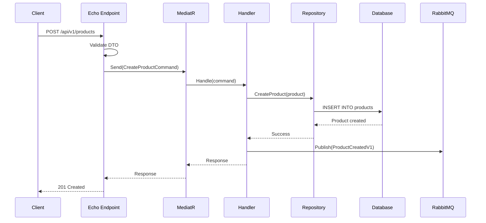

# Catalog Write Service

## Description

The **Catalog Write Service** is a microservice specialized in write operations for product management in the food delivery system. This service implements a modern architecture based on **Vertical Slice Architecture** and **CQRS (Command Query Responsibility Segregation)**, focusing exclusively on write operations (Commands) such as creating, updating, and deleting products.

## Key Features

- 🏗️ **Vertical Slice Architecture**: Organization by complete functionality
- 📝 **CQRS**: Clear separation between commands (write) and queries (read)
- 🎯 **Mediator Pattern**: Decoupling between controllers and business logic
- 📡 **Event-Driven Architecture**: Asynchronous communication via RabbitMQ
- 💉 **Dependency Injection**: Automatic management with Uber FX
- 🔄 **Event Sourcing**: Complete change traceability
- 📊 **Observability**: Metrics and tracing with OpenTelemetry

## Tech Stack

### Go Frameworks and Libraries

- **github.com/labstack/echo/v4**: High-performance web framework
- **go.uber.org/fx**: Framework for building applications with DI
- **gorm.io/gorm**: ORM for database interaction

### Validation and Error Handling

- **github.com/go-playground/validator/v10**: Structure validation
- **emperror.dev/errors**: Advanced error handling
- **github.com/pkg/errors**: Error handling utilities

### Messaging and RPC

- **google.golang.org/grpc**: RPC communication
- **github.com/rabbitmq/amqp091-go**: RabbitMQ messaging
- **github.com/mehdihadeli/go-mediatr**: Mediator pattern

### Observability

- **go.opentelemetry.io/otel**: Tracing and metrics

### Utilities

- **github.com/spf13/cobra**: Command-line applications
- **github.com/satori/go.uuid**: UUID generation
- **github.com/brianvoe/gofakeit/v7**: Fake data generation
- **github.com/iancoleman/strcase**: String conversion utilities

## System Architecture

The service implements a modern architecture with the following patterns:

### Architectural Patterns

1. **CQRS (Command Query Responsibility Segregation)**

- **Commands**: CreateProduct, UpdateProduct, DeleteProduct
- **Separation**: Read operations are handled in another microservice
- **Optimization**: Each side is optimized independently

2. **Mediator Pattern**

- **Decoupling**: Controllers don't call handlers directly
- **Mediation**: The mediator finds and executes the appropriate handler
- **Flexibility**: Easy to add new commands without modifying controllers

3. **Event-Driven Architecture (EDA)**

- **Integration Events**: ProductCreatedV1, ProductUpdatedV1, ProductDeletedV1
- **Publishing**: Events published in RabbitMQ after successful operations
- **Decoupling**: Other microservices can subscribe and react

4. **Dependency Injection**

- **Framework**: Uber FX for automatic dependency management
- **Configuration**: Dependencies injected in constructors
- **Modularity**: Easy testing and maintenance

5. **Repository Pattern**

- **Abstraction**: gormdbcontext as abstraction layer
- **Generic Functions**: FindModelByID, UpdateModel
- **Decoupling**: Business logic independent of persistence details

## Database and Migrations

### Database

- **ORM**: GORM (gorm.io/gorm) for object-relational mapping
- **Abstraction**: gormdbcontext for generic operations
- **Multi-Database**: Support for PostgreSQL, MySQL, ClickHouse and SQLite
- **Transactions**: Guaranteed atomic operations

### Migrations

- **Tool**: Goose for schema management
- **Location**: `db/migrations/` with versioned SQL files
- **Flow**: Migrations applied automatically at startup
- **Versioning**: Control of database schema changes

## API Endpoints

### Products

| Method     | Endpoint                | Description                     | Example Payload                                                                        |
| ---------- | ----------------------- | ------------------------------- | -------------------------------------------------------------------------------------- |
| **POST**   | `/api/v1/products`      | Creates a new product           | `{"name": "Pizza Margherita", "description": "Classic Italian pizza", "price": 15.99}` |
| **PUT**    | `/api/v1/products/{id}` | Updates an existing product     | `{"name": "Pizza Margherita Premium", "price": 17.99}`                                 |
| **GET**    | `/api/v1/products`      | Gets paginated list of products | Query params: `?page=1&size=10&orderBy=createdAt`                                      |
| **DELETE** | `/api/v1/products/{id}` | Deletes a product               | N/A                                                                                    |

### Query Parameters (GET /products)

- `page`: Page number (default: 1, minimum: 1)
- `size`: Page size (default: 10, minimum: 1, maximum: 100)
- `orderBy`: Field to order by (e.g: "createdAt")
- `filters`: Applied filters (e.g: "field=name&value=pizza&comparison=contains")

### Response Codes

- **201**: Product created successfully
- **200**: Query successful
- **204**: Successful operation with no content
- **400**: Invalid request
- **401**: Unauthorized
- **404**: Product not found
- **422**: Validation error
- **500**: Internal server error

## Event Catalog

| Event                | Exchange                    | Routing Key        | Published by        | Description                  |
| -------------------- | --------------------------- | ------------------ | ------------------- | ---------------------------- |
| **ProductCreatedV1** | `catalog.products.exchange` | `products.created` | catalogwriteservice | Product created successfully |
| **ProductUpdatedV1** | `catalog.products.exchange` | `products.updated` | catalogwriteservice | Product updated successfully |
| **ProductDeletedV1** | `catalog.products.exchange` | `products.deleted` | catalogwriteservice | Product deleted successfully |

### Event Structure

All events include:

- **Event ID**: Unique identifier
- **Timestamp**: Creation moment
- **Product ID**: Identifier of the affected product
- **Product Data**: Relevant product information
- **Version**: Event version for compatibility

## Request Flow

### Example: Create Product

1. **HTTP Request**: Client sends POST to `/api/v1/products`
2. **Echo Endpoint**: Receives and routes the request
3. **Validation**: DTO is validated and command is created
4. **Mediator**: Dispatches command to appropriate handler
5. **Handler**: Executes business logic and persists to database
6. **Event**: Publishes integration event in RabbitMQ
7. **Response**: Returns result to client

### Detailed Flow



## Configuration

### Environment Variables

- `DATABASE_URL`: Database connection URL
- `RABBITMQ_URL`: RabbitMQ connection URL
- `PORT`: Server port (default: 7001)
- `ENVIRONMENT`: Execution environment (development, production, test)

### Configuration Files

- `config.development.json`: Configuration for development
- `config.production.json`: Configuration for production
- `config.test.json`: Configuration for testing

## Development

### Prerequisites

- Go 1.24.2 or higher
- PostgreSQL 13+ or MySQL 8+
- RabbitMQ 3.8+
- Docker (optional)

### Installation

```bash
# Clone the repository
git clone <repository-url>
cd go-food-delivery/internal/services/catalogwriteservice

# Install dependencies
go mod download

# Run migrations
go run cmd/migration/main.go

# Run the service
go run cmd/app/main.go
```

### Useful Commands

```bash
# Generate Swagger documentation
swag init -g cmd/app/main.go

# Format code
go fmt ./...

# Linter
golangci-lint run
```

### Docker

```bash
# Build image
docker build -t catalogwriteservice .

# Run container
docker run -p 7001:7001 catalogwriteservice
```

## API Documentation

Complete API documentation is available at:

- **Swagger UI**: `http://localhost:7001/swagger/index.html`
- **OpenAPI Spec**: `http://localhost:7001/swagger/doc.json`

## Monitoring and Observability

### Metrics

- **OpenTelemetry**: Application and system metrics
- **Prometheus**: Compatible with Prometheus metrics
- **Health Checks**: Service health endpoints

### Logging

- **Structured Logging**: Structured logs in JSON
- **Log Levels**: DEBUG, INFO, WARN, ERROR
- **Correlation IDs**: Request traceability

### Tracing

- **Distributed Tracing**: Distributed traceability
- **Jaeger Compatible**: Compatible with Jaeger
- **Performance Monitoring**: Performance monitoring
