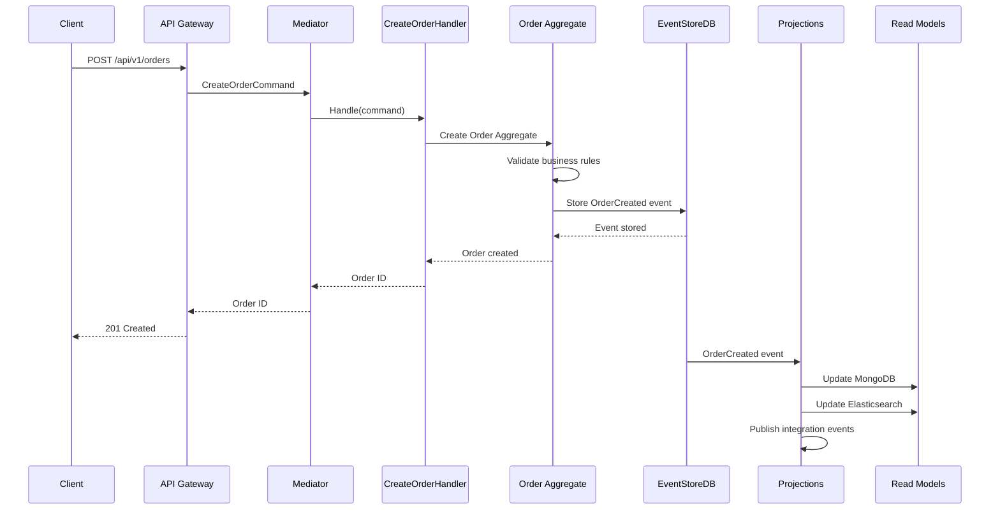

# Order Service

## Description

The **Order Service** is a microservice responsible for managing orders in the food delivery system. This service implements a modern architecture based on **Domain-Driven Design (DDD)**, **Event Sourcing**, and **CQRS (Command Query Responsibility Segregation)**, providing comprehensive order lifecycle management with high scalability and data consistency.

## Key Features

- 🏗️ **Domain-Driven Design**: Rich domain models with aggregates and value objects
- 📝 **Event Sourcing**: Complete audit trail with EventStoreDB
- 🎯 **CQRS**: Clear separation between commands and queries
- 📡 **Event-Driven Architecture**: Asynchronous communication via RabbitMQ
- 💉 **Dependency Injection**: Automatic management with Uber FX
- 📊 **Comprehensive Observability**: Tracing, metrics, and logging with OpenTelemetry
- ⚡ **High Performance**: Optimized read models with MongoDB and Elasticsearch
- 🔒 **Rate Limiting**: Controls request traffic to prevent overload
- 💨 **Gzip Compression**: Reduces response sizes for faster delivery
- ⏱️ **Configurable Timeouts**: Customizable timeouts for various operations

## Tech Stack

### Go Frameworks and Architecture

- **[go.uber.org/fx](https://github.com/uber-go/fx)**: Dependency Injection framework for Go applications
- **Domain-Driven Design (DDD)**: Rich domain models with aggregates and value objects
- **Event Sourcing**: Complete audit trail with EventStoreDB
- **CQRS**: Command Query Responsibility Segregation with go-mediatr

### Web Server and APIs

- **[github.com/labstack/echo/v4](https://github.com/labstack/echo/)**: High-performance HTTP web framework for Go
- **[google.golang.org/grpc](https://grpc.io/)**: For RPC communication (port 6005)
- **HTTP REST API**: RESTful API (port 8000, base path: /api/v1)

### Database and Storage

- **[MongoDB](https://www.mongodb.com/)**: Primary NoSQL database for read models (port 27017)
- **MongoDB Atlas**: Support for cloud-hosted MongoDB
- **[EventStoreDB](https://www.eventstore.com/)**: Event store for event sourcing (ports 2113/1113)
- **[Elasticsearch](https://www.elastic.co/)**: Search engine and indexing (port 9200)

### Messaging

- **[github.com/rabbitmq/amqp091-go](https://github.com/rabbitmq/amqp091-go)**: Message broker for asynchronous communication
- **Producer/Consumer patterns**: Messaging patterns for event handling
- **Integration Events**: Cross-service communication events

### Observability and Monitoring

- **[go.opentelemetry.io/otel](https://opentelemetry.io/)**: For tracing and metrics
- **[Jaeger](https://www.jaegertracing.io/)**: Trace exporter (port 4320)
- **[Zipkin](https://zipkin.io/)**: Trace exporter (port 9411)
- **[Elastic APM](https://www.elastic.co/apm)**: Performance monitoring
- **[Uptrace](https://uptrace.dev/)**: Observability platform

### Development Tools

- **[Air](https://github.com/cosmtrek/air)**: Hot reload for development
- **Make**: Task automation
- **[Docker](https://www.docker.com/)**: Containerization
- **[Protobuf](https://developers.google.com/protocol-buffers)**: Data serialization

## System Architecture

The service implements Event Sourcing with CQRS, using EventStoreDB as the source of truth and projections for optimized read models.

### Architectural Patterns

1. **Event Sourcing**

   - **EventStoreDB**: Source of truth for all domain events
   - **Projections**: Optimized read models for queries
   - **Reconstruction**: Aggregate rebuilding from events

2. **CQRS (Command Query Responsibility Segregation)**

   - **Commands**: CreateOrder, UpdateShoppingCart, SubmitOrder
   - **Queries**: GetOrders, GetOrderById
   - **Separation**: Independent scaling and optimization

3. **Domain-Driven Design (DDD)**

   - **Aggregates**: Order aggregate with business logic
   - **Value Objects**: ShopItem, immutable objects
   - **Domain Events**: OrderCreated, OrderSubmitted, etc.

4. **Event-Driven Architecture (EDA)**
   - **Integration Events**: Cross-service communication
   - **Projections**: Event handlers update read models
   - **Asynchronous**: Decoupled service communication

### High-Level Architecture Diagram

```mermaid
graph TD
    %% =======================
    %% Capa Cliente / Entrada
    %% =======================
    Client["👤 User / Other Service"] -->|1. HTTP/gRPC Request| APIGateway["🌐 API Gateway"]

    APIGateway -->|2. Sends Command/Query| CQRS["⚙️ CQRS / Mediator"]

    %% =======================
    %% Capa Aplicación
    %% =======================
    subgraph App["📦 Order Service"]
        CQRS -->|3. Dispatches| BusinessLogic["🧩 Business Logic"]

        BusinessLogic -->|4. Commands| EventStore["Event Store (EventStoreDB)"]
        BusinessLogic -->|5. Queries| ReadModels["Read Models (MongoDB)"]

        %% Procesamiento de eventos
        BusinessLogic -->|6. Processes Events| EventConsumer["Event Consumer"]

        %% Observabilidad
        BusinessLogic -. metrics/traces .-> Observability["📊 Observability"]
        EventStore -. metrics/traces .-> Observability
        ReadModels -. metrics/traces .-> Observability
        EventConsumer -. metrics/traces .-> Observability
    end

    %% =======================
    %% Capa Infraestructura
    %% =======================
    subgraph Infra["☁️ Infrastructure"]
        EventStoreDB["🗄️ EventStoreDB"]
        MongoDB["📊 MongoDB Atlas"]
        Elasticsearch["🔎 Elasticsearch"]
        RabbitMQ["📩 RabbitMQ"]
        ObservabilityPlatform["📡 Observability Platform"]
    end

    %% Relaciones con infraestructura
    EventStore -->|7. Stores Events| EventStoreDB
    ReadModels -->|8. Reads/Writes| MongoDB
    BusinessLogic -->|9. Search| Elasticsearch
    EventConsumer -->|10. Consumes Messages| RabbitMQ

    RabbitMQ -->|11. Publishes Events| EventConsumer
    EventConsumer -->|12. Updates Projections| BusinessLogic
    BusinessLogic -->|13. Returns Response| APIGateway
    APIGateway -->|14. HTTP/gRPC Response| Client

    %% =======================
    %% Flujo de Eventos
    %% =======================
    subgraph EventFlow["🔄 Event Flow"]
        OrderCreated["OrderCreated"]
        OrderSubmitted["OrderSubmitted"]
        ShoppingCartUpdated["ShoppingCartUpdated"]
    end

    RabbitMQ --> OrderCreated
    RabbitMQ --> OrderSubmitted
    RabbitMQ --> ShoppingCartUpdated

    OrderCreated --> EventConsumer
    OrderSubmitted --> EventConsumer
    ShoppingCartUpdated --> EventConsumer

    %% =======================
    %% Estilos
    %% =======================
    classDef gateway fill:#a5d6a7,stroke:#1b5e20,stroke-width:2px,color:#000
    classDef service fill:#90caf9,stroke:#0d47a1,stroke-width:2px,color:#000
    classDef infrastructure fill:#ce93d8,stroke:#4a148c,stroke-width:2px,color:#000
    classDef event fill:#ffcc80,stroke:#e65100,stroke-width:2px,color:#000
    classDef observability fill:#b2ebf2,stroke:#006064,stroke-width:2px,color:#000

    %% Aplicación de clases
    class APIGateway gateway
    class CQRS,BusinessLogic,EventStore,ReadModels,EventConsumer service
    class EventStoreDB,MongoDB,Elasticsearch,RabbitMQ,ObservabilityPlatform infrastructure
    class OrderCreated,OrderSubmitted,ShoppingCartUpdated event
    class Observability observability
```

The diagram shows the service architecture with three main flows:

- **Command Flow**: Client → API Gateway → CQRS → Business Logic → EventStoreDB
- **Query Flow**: Client → API Gateway → CQRS → Business Logic → Read Models
- **Event Flow**: EventStoreDB → Projections → Read Models → Integration Events

## Database and Storage

- **EventStoreDB**: Event store for domain events (source of truth)
- **MongoDB**: Read models for optimized queries
- **Elasticsearch**: Search and indexing for complex queries
- **Projections**: Event handlers update read models asynchronously

## API Endpoints

The `Order Service` provides RESTful HTTP endpoints for order management.

### Orders

| Method   | Endpoint                            | Description                          | Query Parameters                                   |
| :------- | :---------------------------------- | :----------------------------------- | :------------------------------------------------- |
| **POST** | `/api/v1/orders`                    | Creates a new order                  | None                                               |
| **GET**  | `/api/v1/orders`                    | Retrieves a paginated list of orders | `?page=1&size=10&orderBy=createdAt&search=keyword` |
| **GET**  | `/api/v1/orders/{id}`               | Retrieves a single order by its ID   | None                                               |
| **PUT**  | `/api/v1/orders/{id}/shopping-cart` | Updates shopping cart items          | None                                               |
| **POST** | `/api/v1/orders/{id}/submit`        | Submits an order for processing      | None                                               |

### Query Parameters

- `page`, `size`, `orderBy`, `search` - Standard pagination and filtering

## Event Catalog

The `Order Service` publishes and consumes events for order lifecycle management:

| Event                     | Exchange          | Routing Key           | Published by | Consumed by | Description                    |
| :------------------------ | :---------------- | :-------------------- | :----------- | :---------- | :----------------------------- |
| **OrderCreatedV1**        | `orders.exchange` | `orders.created`      | orderservice | -           | New order created              |
| **OrderSubmittedV1**      | `orders.exchange` | `orders.submitted`    | orderservice | -           | Order submitted for processing |
| **ShoppingCartUpdatedV1** | `orders.exchange` | `orders.cart.updated` | orderservice | -           | Shopping cart items updated    |

## Request Flow

Two main flows: command processing with event sourcing and query processing from read models.

### Example: Create Order

**Flow Summary:**

1. **Command Processing**: POST /api/v1/orders → API Gateway → CQRS → Handler → Aggregate → EventStoreDB
2. **Event Storage**: Domain events stored in EventStoreDB
3. **Projections**: Event handlers update read models (MongoDB, Elasticsearch)
4. **Integration Events**: Published to RabbitMQ for other services

**Performance**: Event sourcing provides complete audit trail with eventual consistency

## Configuration

### Environment Variables

- `DATABASE_URL`, `EVENTSTORE_URL`, `RABBITMQ_URL` - Database connections
- `PORT` - Server port (8000 HTTP, 6005 gRPC)
- `OTEL_EXPORTER_*_ENDPOINT` - Observability exporters (Jaeger, Zipkin, Elastic APM)
